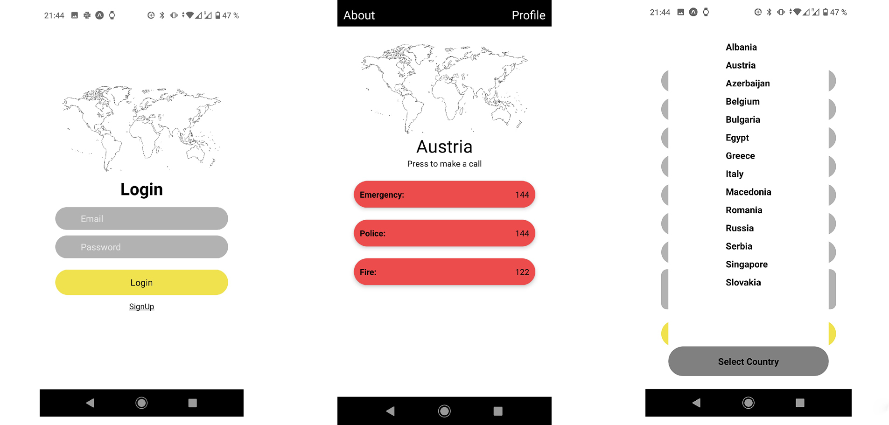

# Global Life

[Frontend Folder](https://github.com/LiaTsernant/global-life-frontend)

[Backend Folder](https://github.com/LiaTsernant/global-life-backend)

### My story
As a traveler, I want to travel and feel safe.
When I had an experience calling 911, I had to wait for 10 minutes to be redirected to emergency phone number and then I needed to explain again my problem.
What if I know I need emergency NOW and I don’t have time to explain my problem twice?
I decided to build an application that displays local direct numbers of rescue services in the location of the device and allows to call these services.

### What I want to see in the application:

* List of countries.
* About page.
* Geolocation.
* Profile,
* Name,
* Email,
* Address,
* Contact person details.

### Technologies Used:
- JavaScript,  
- MongoDB,  
- Node,  
- React Native
